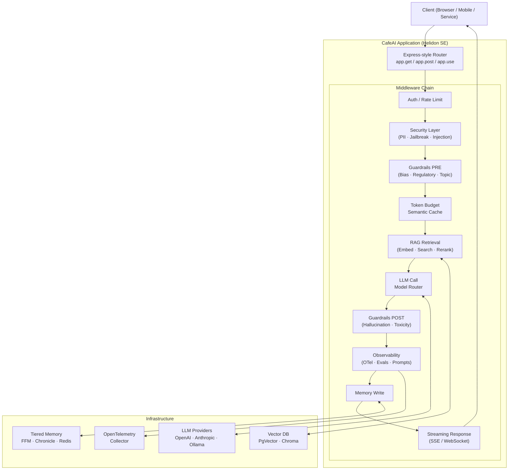

# CafeAI — Formal Specification

> Version: `0.1.0-SNAPSHOT` | March 2026

---

## Mission Statement

> *CafeAI is not an invention of anything new. It is a deliberate re-orientation of familiar,
> battle-tested patterns and paradigms — Java's robustness, Express's composability, Langchain's
> AI primitives — unified into a foundational and composable framework for the AI age.
> Built for Java developers who refuse to trade understanding for convenience.*

---

## Table of Contents

1. [Introduction](#1-introduction)
2. [Architecture](#2-architecture)
3. [API Vocabulary](#3-api-vocabulary)
4. [Incremental Adoption Ladder](#4-incremental-adoption-ladder)
5. [Technology Stack](#5-technology-stack)
6. [Java 21+ Feature Map](#6-java-21-feature-map)
7. [Tiered Memory Architecture](#7-tiered-memory-architecture)
8. [Module Structure](#8-module-structure)
9. [Naming Philosophy](#9-naming-philosophy)
10. [Blog and Conference Series](#10-blog-and-conference-series)

---

## 1. Introduction

The Java ecosystem is at an inflection point. Generative AI is no longer an experimental novelty —
it is a production requirement. Yet the dominant Java AI frameworks abstract so aggressively that
developers can wire up a RAG pipeline without understanding what is happening underneath. That is
fine for shortcuts. It is catastrophic for learning, teaching, and long-term maintainability.

CafeAI exists to fill that gap. It is a reference architecture and framework for incrementally
adopting Gen AI in Java — built on Helidon SE, powered by Langchain4j, and structured around the
Express.js middleware pattern that Java developers already know and trust.

### 1.1 Why Not Spring Boot?

Spring AI is a legitimate choice for production shortcuts. CafeAI is a different proposition.
Spring AI's abstraction layers mean developers can build AI features without understanding the
plumbing. CafeAI's Helidon SE foundation forces you to understand the plumbing. That is not a
weakness — it is the entire point. Conviction and authority in AI engineering come from
understanding, not configuration.

**The differentiator in one sentence:** Spring AI is for convenience. CafeAI is for conviction.

### 1.2 The Three Lineages

CafeAI stands deliberately on the shoulders of three proven traditions:

| Lineage | Contribution | Why It Matters |
|---|---|---|
| **Java / JVM** | Robustness, FFM, Structured Concurrency, Virtual Threads | Enterprise systems are already here |
| **Express.js / Node** | Middleware composability, ergonomic API | Zero mental model ramp-up for Java devs |
| **Python Langchain** | AI primitives vocabulary, RAG, agents | Parity for AI practitioners across languages |

### 1.3 The Name

- **Cafe** → instantly recognizable as a coffee shop — *Java*
- **AI** → the technology we're introducing
- **CafeAI** → phonetically *"kaf-ai"* — a natural coming together of Java and AI

---

## 2. Architecture

### 2.1 The Middleware Pipeline

Everything in CafeAI is middleware. HTTP concerns, AI concerns, security, observability,
guardrails — all composable, all testable, all replaceable. This is the lesson Express taught us.
CafeAI carries it to the AI age.

The full request pipeline:

```
Incoming Request
   │
   ├─► [ auth / JWT ]                  ← standard HTTP middleware
   ├─► [ rate limiter ]                ← standard HTTP middleware
   ├─► [ PII scrubber ]                ← security middleware
   ├─► [ jailbreak detector ]          ← security middleware
   ├─► [ prompt injection guard ]      ← security middleware
   ├─► [ guardrails PRE ]              ← ethical / regulatory middleware
   ├─► [ token budget enforcer ]       ← cost middleware
   ├─► [ semantic cache lookup ]       ← memory middleware
   ├─► [ RAG retrieval ]               ← rag middleware
   ├─► [ LLM call / model router ]     ← ai middleware
   ├─► [ guardrails POST ]             ← ethical / regulatory middleware
   ├─► [ hallucination scorer ]        ← guardrail middleware
   ├─► [ observability / OTel trace ]  ← observe middleware
   ├─► [ memory write ]                ← memory middleware
   └─► [ streaming response ]          ← streaming middleware (SSE / WebSocket)
```

Every hard problem in Gen AI is a middleware concern. Each layer is independently teachable,
independently testable, and independently deployable. **The pipeline is the curriculum.**

### 2.2 Architecture Diagram



---

## 3. API Vocabulary

CafeAI introduces a deliberate, self-consistent vocabulary for AI-native Java development.
Every name is guessable before you look it up. The naming philosophy is consistent throughout:
**verbs declare actions, nouns declare registrations, strategies are configurable.**

### 3.1 Express-Parity HTTP Primitives

These mirror Express.js pound-for-pound. No deviation, no ceremony.

```java
app.get(path, handler)        // GET route
app.post(path, handler)       // POST route
app.put(path, handler)        // PUT route
app.patch(path, handler)      // PATCH route
app.delete(path, handler)     // DELETE route
app.use(middleware)           // global middleware — applies to every request
app.use(path, middleware)     // path-scoped middleware
app.use(path, router)         // mount a sub-router
app.listen(port)              // start the server
app.listen(port, onStart)     // start with startup callback
```

### 3.2 AI Infrastructure Primitives

```java
app.ai(OpenAI.gpt4o())                     // register LLM provider
app.ai(Anthropic.claude35Sonnet())         // swap providers freely — zero app changes
app.ai(Ollama.llama3())                    // local model — no data leaves your infra
app.ai(ModelRouter.smart()                 // smart routing: cheap vs expensive
        .simple(OpenAI.gpt4oMini())
        .complex(OpenAI.gpt4o()))

app.system("You are...")                   // system prompt — AI persona and rules
app.template("name", "Hello {{user}}")    // named, reusable prompt templates
```

### 3.3 Memory Primitives

```java
app.memory(MemoryStrategy.inMemory())      // Rung 1: JVM HashMap — prototype, zero deps
app.memory(MemoryStrategy.mapped())       // Rung 2: SSD-backed via Java FFM MemorySegment
app.memory(MemoryStrategy.chronicle())    // Rung 3: Chronicle Map — off-heap, high-throughput
app.memory(MemoryStrategy.redis(config))  // Rung 4: Redis via Lettuce — distributed
app.memory(MemoryStrategy.memcached(cfg)) // Rung 5: Memcached — distributed
app.memory(MemoryStrategy.hybrid()        // Rung 6: warm SSD + cold Redis
        .warm(MemoryStrategy.mapped())
        .cold(MemoryStrategy.redis(config)))
```

### 3.4 RAG Primitives

```java
app.vectordb(PgVector.connect(config))    // register vector store
app.vectordb(Chroma.local())
app.vectordb(VectorStore.inMemory())      // prototype / testing

app.embed(EmbeddingModel.local())         // local ONNX via FFM — no API call
app.embed(EmbeddingModel.openAi())        // remote — high quality

app.ingest(Source.pdf("handbook.pdf"))    // ingest knowledge sources
app.ingest(Source.url("https://..."))
app.ingest(Source.directory("docs/"))
app.ingest(Source.github("owner/repo"))

app.rag(Retriever.semantic(5))            // dense semantic retrieval — top-K
app.rag(Retriever.hybrid(5))              // dense + sparse (BM25) combined
```

### 3.5 Tool and MCP Primitives

```java
// A "tool"  = Java function you wrote. You own its trust and lifecycle.
// An "mcp"  = external MCP server capability. External contract, different trust.

app.tool(OrderLookupTool.create())         // single tool
app.tools(tool1, tool2, tool3)             // tool suite
app.mcp(McpServer.github())                // pre-built MCP integrations
app.mcp(McpServer.connect("http://..."))   // any MCP server by URL
```

### 3.6 Chain Primitives

```java
// Chains are named, composable pipelines.
// Crucially: chains are themselves middleware-composable — recursive by design.

app.chain("classify-and-respond",
    Steps.classify(),
    Steps.route(),
    Steps.respond())

app.chain("triage").use(authMiddleware)    // chains accept middleware
```

### 3.7 Guardrail Primitives

```java
app.guard(GuardRail.pii())                 // PII detection + scrubbing — pre and post LLM
app.guard(GuardRail.jailbreak())           // adversarial prompt detection
app.guard(GuardRail.promptInjection())     // data-sourced injection attack detection
app.guard(GuardRail.bias())                // demographic bias detection in outputs
app.guard(GuardRail.hallucination())       // factual grounding scoring vs RAG corpus
app.guard(GuardRail.toxicity())            // harmful content filtering
app.guard(GuardRail.regulatory()           // GDPR, HIPAA, FCRA, CCPA
        .gdpr().hipaa().fcra())
app.guard(GuardRail.topicBoundary()        // scope enforcement
        .allow("customer service", "orders")
        .deny("politics", "medical advice"))
app.guard(myCustomGuardRail)               // bring your own
```

### 3.8 Agent Primitives

```java
// Each agent runs in its own StructuredTaskScope.
// Failures are isolated. Results are joined cleanly.

app.agent("classifier", AgentDefinition.react()
        .tools(classifyTool)
        .maxIterations(5))

app.orchestrate("support-pipeline",        // multi-agent topology
        "classifier",
        "knowledge-retriever",
        "response-generator")
```

### 3.9 Observability Primitives

```java
app.observe(ObserveStrategy.otel())        // OpenTelemetry — production
app.observe(ObserveStrategy.console())     // console logging — development

app.eval(EvalHarness.defaults())           // retrieval + response quality scoring
```

### 3.10 Full Bootstrap Example

```java
var app = CafeAI.create();

// ── Infrastructure ──────────────────────────────────────────
app.ai(OpenAI.gpt4o());
app.memory(MemoryStrategy.mapped());
app.vectordb(PgVector.connect(config));
app.embed(EmbeddingModel.local());
app.observe(ObserveStrategy.otel());

// ── Knowledge ───────────────────────────────────────────────
app.ingest(Source.pdf("docs/handbook.pdf"));
app.rag(Retriever.semantic(5));

// ── Safety ──────────────────────────────────────────────────
app.guard(GuardRail.pii());
app.guard(GuardRail.jailbreak());
app.guard(GuardRail.promptInjection());

// ── Persona ─────────────────────────────────────────────────
app.system("""
    You are a helpful, empathetic customer service agent for Acme Corp.
    You are concise, accurate, and always escalate unresolved issues.
    """);

// ── Tools ───────────────────────────────────────────────────
app.tool(OrderLookupTool.create());
app.mcp(McpServer.github());

// ── Routes ──────────────────────────────────────────────────
app.use(Middleware.json());
app.use(Middleware.rateLimit(60));

app.get("/health", (req, res) ->
    res.json(Map.of("status", "ok")));

app.post("/chat", (req, res) ->
    res.stream(app.prompt(req.body("message"))));

// ── Start ────────────────────────────────────────────────────
app.listen(8080, () ->
    System.out.println("☕ CafeAI is brewing on :8080"));
```

Read that out loud. A Java developer who has never touched Gen AI understands every line. An
Express developer who has never touched Java understands the structure. A Python LangChain
developer recognizes the concepts. **Three audiences. Zero confusion.**

---

## 4. Incremental Adoption Ladder

CafeAI is explicitly designed to be adopted incrementally. No team swallows the whole stack on
day one. Each rung is independently valuable. Each rung composes naturally with the ones above it.

| Rung | Capability | Modules Required | What You Learn |
|---|---|---|---|
| 1 | Plain LLM call | `core` | Helidon SE + Langchain4j basics |
| 2 | Prompt templates | `core` | Structured prompt engineering |
| 3 | Context memory | `core` + `memory` | Conversation state, FFM memory API |
| 4 | RAG | `core` + `memory` + `rag` | Ingestion, embeddings, retrieval |
| 5 | Tool use / MCP | `core` + `tools` | Giving the AI actions to take |
| 6 | Guardrails | `core` + `guardrails` | Safety, ethics, compliance as middleware |
| 7 | Agents | `core` + `agents` | Autonomous reasoning, Structured Concurrency |
| 8 | Observability + Evals | `core` + `observability` | Production measurement, prompt versioning |
| 9 | Streaming | `core` + `streaming` | SSE, backpressure, real-time UX |
| 10 | Security | `core` + `security` | Injection, leakage, adversarial robustness |

---

## 5. Technology Stack

| Concern | Technology | Version | Rationale |
|---|---|---|---|
| Runtime | Java | 21+ | FFM, Structured Concurrency, Vector API, Virtual Threads |
| HTTP Server | Helidon SE | 4.1.4 | Lightweight, reactive, first-class Java 21+ support |
| AI Framework | Langchain4j | 0.35.0 | Mirrors Python Langchain — parity for AI practitioners |
| LLM Providers | OpenAI / Anthropic / Ollama | — | Provider-agnostic — swap without changing app logic |
| Memory Tier 1–2 | Java FFM `MemorySegment` | JDK 21 | Off-heap, SSD-backed, no GC pressure, no network |
| Memory Tier 3 | Chronicle Map | 3.25 | Designed for off-heap key-value, high-throughput |
| Memory Tier 4–5 | Redis via Lettuce | 6.3 | Reactive, non-blocking distributed cache |
| Vector DB | PgVector / Chroma | — | PgVector for enterprise; Chroma for local |
| Embeddings | ONNX via FFM / OpenAI | — | Local via FFM; remote via API |
| Observability | OpenTelemetry | 1.40.0 | Helidon SE has first-class OTel support |
| PII Detection | Apache OpenNLP | 2.3.3 | JVM-native NLP — no external API dependency |
| Build | Gradle (Groovy DSL) | 8.x | Standard Java toolchain |

---

## 6. Java 21+ Feature Map

CafeAI treats Java 21+ features as load-bearing architecture — not novelties to demo.

| Feature | CafeAI Usage | Why It Matters |
|---|---|---|
| **FFM API** | Native ML bindings (ONNX, llama.cpp) | JNI-free native library access |
| **FFM `MemorySegment`** | SSD-backed session memory | Off-heap, OS page cache, crash-recovery |
| **Structured Concurrency** | Multi-agent orchestration | Isolated failures, clean result joins |
| **Scoped Values** | Request context propagation | No `ThreadLocal` hacks |
| **Vector API** | Cosine similarity, dot products for RAG | SIMD hardware acceleration |
| **Virtual Threads** | Every request handler | I/O-bound LLM calls at zero thread cost |

---

## 7. Tiered Memory Architecture

CafeAI's memory model mirrors the hardware memory hierarchy — starting at the cheapest tier
and escalating only when the problem demands it.

```
Hot    →  JVM Heap            (active conversation turn — current request)
Warm   →  FFM MemorySegment   (recent sessions — SSD-backed, OS page cache managed)
Cool   →  Chronicle Map       (high-throughput off-heap, single node)
Cold   →  Redis / Memcached   (distributed — the escape valve)
Frozen →  Vector DB           (semantic long-term memory, RAG corpus)
```

### The Key Insight

Most applications do not need Redis. The SSD-backed FFM tier handles production single-node
deployments with:
- Zero network overhead
- Zero cloud tax
- Crash-recovery for free (memory-mapped files survive restarts)
- OS page cache doing the heavy lifting automatically

Redis is the **escape valve** — reached for when you genuinely need state shared across
multiple application instances. Not the default.

### Why FFM for Memory is Architecturally Coherent

CafeAI uses the FFM API in two places:

1. **Native ML library bindings** — ONNX runtime, llama.cpp, without JNI ceremony
2. **Off-heap session memory** — `MemorySegment` for SSD-backed conversation context

The same API surface. The same developer skills. Two completely different use cases. That
coherence is intentional — CafeAI doesn't introduce a new tool for every new problem.

### Serialization for Off-Heap Memory

Conversation context stored in `MemorySegment` needs compact, schema-aware serialization.
Candidates:

| Option | Tradeoff |
|---|---|
| **FlatBuffers** | Zero-copy reads, schema-enforced, ideal for off-heap |
| **Chronicle Map** | Designed for this exact pattern — off-heap key-value |
| **Custom `MemoryLayout`** | Maximum control, excellent blog post material |

---

## 8. Module Structure

```
cafeai/
├── build.gradle                  ← root build, version catalog, shared config
├── settings.gradle               ← module declarations
├── README.md                     ← project front door
├── docs/
│   ├── SPEC.md                   ← this document
│   ├── adr/                      ← Architecture Decision Records
│   │   ├── ADR-001-helidon-se.md
│   │   ├── ADR-002-middleware-pattern.md
│   │   ├── ADR-003-tiered-memory.md
│   │   └── ADR-004-ffm-for-memory.md
│   ├── api/                      ← generated Javadoc (gitignored)
│   └── blog/                     ← blog post drafts in markdown
│
├── cafeai-core/                  ← Express-style API, routing, middleware, AI primitives
├── cafeai-memory/                ← Tiered context memory
├── cafeai-rag/                   ← RAG pipeline, vector stores, ingestion
├── cafeai-tools/                 ← Tool registration, MCP integration
├── cafeai-agents/                ← ReAct, multi-agent, Structured Concurrency
├── cafeai-guardrails/            ← PII, jailbreak, bias, hallucination, compliance
├── cafeai-observability/         ← OTel, metrics, evals, prompt versioning
├── cafeai-security/              ← Prompt injection, data leakage, cache poisoning
├── cafeai-streaming/             ← SSE, WebSocket, reactive backpressure
└── cafeai-examples/              ← Runnable adoption ladder — the tutorial as code
```

Each module is an independently useful unit. `cafeai-core` has zero AI-specific dependencies
beyond Langchain4j core and Helidon SE. Every other module is opt-in.

---

## 9. Naming Philosophy

| Principle | Examples |
|---|---|
| **Verbs declare actions** | `ingest`, `embed`, `guard`, `observe`, `orchestrate` |
| **Nouns declare registrations** | `memory`, `tool`, `agent`, `chain` |
| **Strategies are configurable** | `MemoryStrategy`, `EmbeddingModel`, `GuardRail`, `Retriever` |
| **Everything is composable** | chains accept middleware, guardrails are middleware, agents are composable |
| **Names are guessable** | a developer should be right before they look it up |
| **No abbreviations** | `vectordb` not `vdb`, `system` not `sys`, `observe` not `obs` |

The goal is for CafeAI's API to feel **inevitable** — as if it could not have been designed any
other way. That feeling comes from consistency, not cleverness.

---

## 10. Blog and Conference Series

Each module is a self-contained teachable unit. The project structure **is** the curriculum.
Each post is a rung on the adoption ladder.

| # | Title |
|---|---|
| 1 | **Brewing AI in Java** — CafeAI Introduction and Philosophy |
| 2 | **The Middleware Pattern Meets Gen AI** — From Express to CafeAI |
| 3 | **Your First LLM Call Without Spring Boot** — Helidon SE + Langchain4j |
| 4 | **Prompt Engineering in Java** — Templates, System Prompts, and the API Vocabulary |
| 5 | **Context Memory Without the Cloud Tax** — Java FFM and the Tiered Memory Model |
| 6 | **Building a RAG Pipeline in Java** — Ingestion, Embedding, and Retrieval |
| 7 | **Tool Use and MCP in Java** — The Difference Between a Tool and an MCP Server |
| 8 | **Ethical Guardrails as Middleware** — PII, Jailbreak, Bias, and Hallucination |
| 9 | **Multi-Agent Orchestration with Java Structured Concurrency** |
| 10 | **Production-Grade AI Observability** — OpenTelemetry, Evals, and Prompt Versioning |
| 11 | **AI Security Beyond Guardrails** — Prompt Injection, Data Leakage, and Cache Poisoning |
| 12 | **Token Streaming in Java** — SSE, WebSocket, and Reactive Backpressure |

---

*CafeAI v0.1.0-SNAPSHOT — Not an invention of anything new. A re-orientation of everything proven.*
