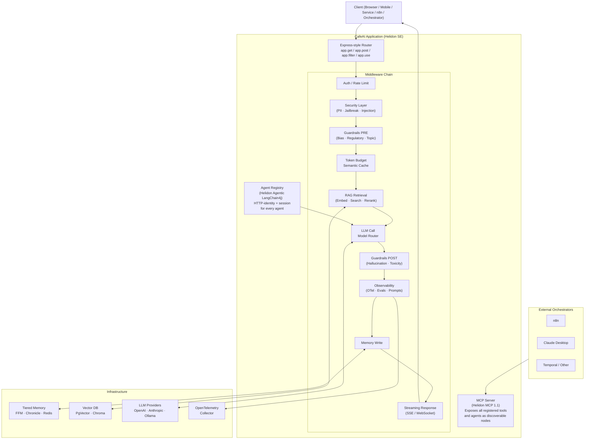

# CafeAI — Formal Specification

> Version: `0.1.0-SNAPSHOT` | March 2026

---

## Mission Statement

> *CafeAI is not an invention of anything new. It is a deliberate re-orientation of familiar,
> battle-tested patterns and paradigms — Java's robustness, Express's composability, Langchain's
> AI primitives — unified into a foundational and composable framework for the AI age.
> Built for Java developers who refuse to trade understanding for convenience.*

---

## Table of Contents

1. [Introduction](#1-introduction)
2. [Architecture](#2-architecture)
3. [API Vocabulary](#3-api-vocabulary)
4. [Incremental Adoption Ladder](#4-incremental-adoption-ladder)
5. [Technology Stack](#5-technology-stack)
6. [Java 21+ Feature Map](#6-java-21-feature-map)
7. [Tiered Memory Architecture](#7-tiered-memory-architecture)
8. [Module Structure](#8-module-structure)
9. [Naming Philosophy](#9-naming-philosophy)
10. [The HTTP Identity Layer — CafeAI's Foundational Position](#10-the-http-identity-layer)
11. [The Two Strategic Directions](#11-the-two-strategic-directions)
12. [The Helidon Escape Hatch](#12-the-helidon-escape-hatch)
13. [The Agent Mental Model](#13-the-agent-mental-model)
14. [Blog and Conference Series](#14-blog-and-conference-series)
12. [Blog and Conference Series](#12-blog-and-conference-series)

---

## 1. Introduction

The Java ecosystem is at an inflection point. Generative AI is no longer an experimental novelty —
it is a production requirement. Yet the dominant Java AI frameworks abstract so aggressively that
developers can wire up a RAG pipeline without understanding what is happening underneath. That is
fine for shortcuts. It is catastrophic for learning, teaching, and long-term maintainability.

CafeAI exists to fill that gap. It is a reference architecture and framework for incrementally
adopting Gen AI in Java — built on Helidon SE, powered by Langchain4j, and structured around the
Express.js middleware pattern that Java developers already know and trust.

### 1.1 Why Not Spring Boot?

Spring AI is a legitimate choice for production shortcuts. CafeAI is a different proposition.
Spring AI's abstraction layers mean developers can build AI features without understanding the
plumbing. CafeAI's Helidon SE foundation forces you to understand the plumbing. That is not a
weakness — it is the entire point. Conviction and authority in AI engineering come from
understanding, not configuration.

**The differentiator in one sentence:** Spring AI is for convenience. CafeAI is for conviction.

### 1.2 The Three Lineages

CafeAI stands deliberately on the shoulders of three proven traditions:

| Lineage | Contribution | Why It Matters |
|---|---|---|
| **Java / JVM** | Robustness, FFM, Structured Concurrency, Virtual Threads | Enterprise systems are already here |
| **Express.js / Node** | Middleware composability, ergonomic API | Zero mental model ramp-up for Java devs |
| **Python Langchain** | AI primitives vocabulary, RAG, agents | Parity for AI practitioners across languages |

### 1.3 The Name

- **Cafe** → instantly recognizable as a coffee shop — *Java*
- **AI** → the technology we're introducing
- **CafeAI** → phonetically *"kaf-ai"* — a natural coming together of Java and AI

---

## 2. Architecture

### 2.1 The Middleware Pipeline

Everything in CafeAI is middleware. HTTP concerns, AI concerns, security, observability,
guardrails — all composable, all testable, all replaceable. This is the lesson Express taught us.
CafeAI carries it to the AI age.

The full request pipeline:

```
Incoming Request
   │
   ├─► [ auth / JWT ]                  ← standard HTTP middleware
   ├─► [ rate limiter ]                ← standard HTTP middleware
   ├─► [ PII scrubber ]                ← security middleware
   ├─► [ jailbreak detector ]          ← security middleware
   ├─► [ prompt injection guard ]      ← security middleware
   ├─► [ guardrails PRE ]              ← ethical / regulatory middleware
   ├─► [ token budget enforcer ]       ← cost middleware
   ├─► [ semantic cache lookup ]       ← memory middleware
   ├─► [ RAG retrieval ]               ← rag middleware
   ├─► [ LLM call / model router ]     ← ai middleware
   ├─► [ guardrails POST ]             ← ethical / regulatory middleware
   ├─► [ hallucination scorer ]        ← guardrail middleware
   ├─► [ observability / OTel trace ]  ← observe middleware
   ├─► [ memory write ]                ← memory middleware
   └─► [ streaming response ]          ← streaming middleware (SSE / WebSocket)
```

Every hard problem in Gen AI is a middleware concern. Each layer is independently teachable,
independently testable, and independently deployable. **The pipeline is the curriculum.**

### 2.2 Architecture Diagram



---

## 3. API Vocabulary

CafeAI introduces a deliberate, self-consistent vocabulary for AI-native Java development.
Every name is guessable before you look it up. The naming philosophy is consistent throughout:
**verbs declare actions, nouns declare registrations, strategies are configurable.**

### 3.1 Express-Parity HTTP Primitives

These mirror Express.js pound-for-pound. No deviation, no ceremony.

```java
app.get(path, middleware...)     // GET route — variadic middleware pipeline
app.post(path, middleware...)    // POST route
app.put(path, middleware...)     // PUT route
app.patch(path, middleware...)   // PATCH route
app.delete(path, middleware...)  // DELETE route
app.filter(middleware...)        // cross-cutting pre-processing — before route dispatch
app.filter(path, middleware...)  // path-scoped pre-processing
app.use(path, router)           // mount a sub-router
app.listen(port)                // start the server
app.listen(port, onStart)       // start with startup callback
```

### 3.2 AI Infrastructure Primitives

```java
app.ai(OpenAI.gpt4o())                     // register LLM provider
app.ai(Anthropic.claude35Sonnet())         // swap providers freely — zero app changes
app.ai(Ollama.llama3())                    // local model — no data leaves your infra
app.ai(ModelRouter.smart()                 // smart routing: cheap vs expensive
        .simple(OpenAI.gpt4oMini())
        .complex(OpenAI.gpt4o()))

app.system("You are...")                   // system prompt — AI persona and rules
app.template("name", "Hello {{user}}")    // named, reusable prompt templates
```

### 3.3 Memory Primitives

```java
app.memory(MemoryStrategy.inMemory())      // ephemeral — good for development
app.memory(MemoryStrategy.mapped())        // SSD-backed FFM — production single-node
app.memory(MemoryStrategy.redis())         // distributed — multi-node deployments
```

### 3.4 RAG Primitives

```java
app.vectordb(VectorStore.inMemory())       // development vector store
app.vectordb(VectorStore.pgVector(url))    // production PostgreSQL + pgvector
app.vectordb(VectorStore.chroma(url))      // Chroma vector database

app.embed(EmbeddingModel.local())          // bundled ONNX model — no API key
app.embed(EmbeddingModel.openAI())         // OpenAI text-embedding-3-small

app.ingest(Source.text(content, name))     // ingest raw text
app.ingest(Source.file(path))              // ingest from file
app.ingest(Source.url(url))                // ingest from URL

app.rag(Retriever.semantic(topK))          // semantic similarity retrieval
app.rag(Retriever.hybrid(topK))            // keyword + semantic fusion
```

### 3.5 Tool and MCP Primitives

```java
app.tool(new GitHubTools())               // register @CafeAITool-annotated class
app.mcp(McpEndpoint.at(url))              // connect to external MCP server as client

// NEW — MCP server direction (ROADMAP-11)
app.mcp().serve("/mcp")                   // expose all registered tools and agents
                                          // as an MCP server via Helidon MCP 1.1
```

### 3.6 Guardrail and Security Primitives

```java
app.guard(GuardRail.promptInjection())    // block prompt injection
app.guard(GuardRail.jailbreak())          // block adversarial prompts
app.guard(GuardRail.topicBoundary()       // enforce topic scope
    .allow("helios", "connection", ...))
app.guard(GuardRail.regulatory()          // GDPR, HIPAA, FCRA, CCPA
    .gdpr().hipaa())

app.filter(AiSecurity.promptInjectionDetector())  // strict injection detection
AiSecurity.onEvent(event -> { ... })              // typed audit event listener
```

### 3.7 Observability Primitives

```java
app.observe(ObserveStrategy.console())    // development console traces
app.observe(ObserveStrategy.otel())       // OpenTelemetry export
app.eval(EvalStrategy.relevance())        // RAG relevance scoring
app.eval(EvalStrategy.faithfulness())     // hallucination detection
```

### 3.8 Agent Primitives (ROADMAP-12 — Helidon Agentic Direction)

```java
// NEW — agent direction (ROADMAP-12)
app.agent("support-agent", SupportAgent.class)  // register Helidon/LangChain4j agent
                                                 // with HTTP identity + session + observability

app.post("/support", (req, res, next) -> {
    var result = app.agent("support-agent", SupportAgent.class)
                    .session(req.header("X-Session-Id"))
                    .run(agent -> agent.answer(req.body("message")));
    res.json(Map.of("answer", result));
});
```

### 3.9 Connection Primitives

```java
app.connect(Ollama.at("http://localhost:11434").model("qwen2.5")
              .onUnavailable(Fallback.use(OpenAI.gpt4oMini())))
app.connect(Redis.at("localhost:6379"))
app.connect(PgVector.at(jdbcUrl))
```

---

## 4. Incremental Adoption Ladder

CafeAI is explicitly designed to be adopted incrementally. No team swallows the whole stack on
day one. Each rung is independently valuable. Each rung composes naturally with the ones above it.

| Rung | Capability | Modules Required | What You Learn |
|---|---|---|---|
| 1 | Plain LLM call | `core` | Helidon SE + Langchain4j basics |
| 2 | Prompt templates | `core` | Structured prompt engineering |
| 3 | Context memory | `core` + `memory` | Conversation state, FFM memory API |
| 4 | RAG | `core` + `memory` + `rag` | Ingestion, embeddings, retrieval |
| 5 | Tool use / MCP client | `core` + `tools` | Giving the AI actions to take |
| 6 | Guardrails | `core` + `guardrails` | Safety, ethics, compliance as middleware |
| 7 | Observability + Evals | `core` + `observability` | Production measurement |
| 8 | Security | `core` + `security` | Injection, leakage, adversarial robustness |
| 9 | MCP server | `core` + `cafeai-mcp` | Expose capabilities to external orchestrators |
| 10 | Agents | `core` + `cafeai-agents` | Helidon agentic + HTTP identity |

---

## 5. Technology Stack

| Concern | Technology | Version | Rationale |
|---|---|---|---|
| Runtime | Java | 21+ | FFM, Structured Concurrency, Vector API, Virtual Threads |
| HTTP Server | Helidon SE | 4.4.0 | MCP 1.1 server, agentic LangChain4j, LTS release |
| AI Framework | LangChain4j | 1.11+ | Via Helidon 4.4 integration |
| LLM Providers | OpenAI / Anthropic / Ollama | — | Provider-agnostic — swap without changing app logic |
| Memory Tier 1–2 | Java FFM `MemorySegment` | JDK 21 | Off-heap, SSD-backed, no GC pressure, no network |
| Memory Tier 3 | Chronicle Map | 3.25 | Designed for off-heap key-value, high-throughput |
| Memory Tier 4–5 | Redis via Lettuce | 6.3 | Reactive, non-blocking distributed cache |
| Vector DB | PgVector / Chroma | — | PgVector for enterprise; Chroma for local |
| Embeddings | ONNX via FFM / OpenAI | — | Local via FFM; remote via API |
| MCP Server | Helidon MCP 1.1 | 4.4.0 | June 2025 spec, Elicitation support |
| Observability | OpenTelemetry | 1.40.0+ | Helidon SE has first-class OTel support |
| Build | Gradle (Groovy DSL) | 8.x | Standard Java toolchain |

---

## 6. Java 21+ Feature Map

CafeAI treats Java 21+ features as load-bearing architecture — not novelties to demo.

| Feature | CafeAI Usage | Why It Matters |
|---|---|---|
| **FFM API** | Native ML bindings (ONNX, llama.cpp) | JNI-free native library access |
| **FFM `MemorySegment`** | SSD-backed session memory | Off-heap, OS page cache, crash-recovery |
| **Structured Concurrency** | Agent invocation + parallel tool execution | Isolated failures, clean result joins |
| **Scoped Values** | Request context propagation | No `ThreadLocal` hacks |
| **Vector API** | Cosine similarity, dot products for RAG | SIMD hardware acceleration |
| **Virtual Threads** | Every request handler, every agent | I/O-bound LLM calls at zero thread cost |

---

## 7. Tiered Memory Architecture

CafeAI's memory model mirrors the hardware memory hierarchy — starting at the cheapest tier
and escalating only when the problem demands it.

```
Hot    →  JVM Heap            (active conversation turn — current request)
Warm   →  FFM MemorySegment   (recent sessions — SSD-backed, OS page cache managed)
Cool   →  Chronicle Map       (high-throughput off-heap, single node)
Cold   →  Redis / Memcached   (distributed — the escape valve)
Frozen →  Vector DB           (semantic long-term memory, RAG corpus)
```

### The Key Insight

Most applications do not need Redis. The SSD-backed FFM tier handles production single-node
deployments with zero network overhead, zero cloud tax, and crash-recovery for free.
Redis is the **escape valve** — reached for when you genuinely need state shared across
multiple application instances. Not the default.

---

## 8. Module Structure

```
cafeai/
├── build.gradle
├── settings.gradle
├── README.md
├── docs/
│   ├── SPEC.md                         ← this document
│   ├── adr/                            ← Architecture Decision Records (ADR-001 to ADR-010)
│   └── roadmap/                        ← Roadmaps and Milestones (ROADMAP-01 to ROADMAP-12)
│
├── cafeai-core/                        ← Express-style API, routing, middleware, AI primitives
├── cafeai-memory/                      ← Tiered context memory
├── cafeai-rag/                         ← RAG pipeline, vector stores, ingestion
├── cafeai-tools/                       ← Tool registration, @CafeAITool
├── cafeai-guardrails/                  ← PII, jailbreak, bias, hallucination, compliance
├── cafeai-observability/               ← OTel, metrics, evals, prompt versioning
├── cafeai-security/                    ← Prompt injection, data leakage, cache poisoning
├── cafeai-connect/                     ← Provider connection, probing, fallback
├── cafeai-mcp/                         ← MCP server — exposes CafeAI capabilities as
│                                         discoverable nodes via Helidon MCP 1.1 (ROADMAP-11)
├── cafeai-agents/                      ← HTTP identity layer for Helidon agentic LangChain4j
│                                         (ROADMAP-12)
└── cafeai-examples/                    ← Runnable adoption ladder — the tutorial as code
```

---

## 9. Naming Philosophy

| Principle | Examples |
|---|---|
| **Verbs declare actions** | `ingest`, `embed`, `guard`, `observe`, `orchestrate` |
| **Nouns declare registrations** | `memory`, `tool`, `agent`, `mcp` |
| **Strategies are configurable** | `MemoryStrategy`, `EmbeddingModel`, `GuardRail`, `Retriever` |
| **Everything is composable** | guardrails are middleware, agents get HTTP identity, tools become MCP nodes |
| **Names are guessable** | a developer should be right before they look it up |
| **No abbreviations** | `vectordb` not `vdb`, `system` not `sys`, `observe` not `obs` |

The goal is for CafeAI's API to feel **inevitable** — as if it could not have been designed any
other way. That feeling comes from consistency, not cleverness.

---

## 10. The HTTP Identity Layer — CafeAI's Foundational Position

This section documents the architectural insight that crystallised through deep analysis of the
Java AI ecosystem in March 2026. It explains not just *what* CafeAI is, but *why* it occupies
the position it does — and why that position is both distinct and durable.

### 10.1 How the Insight Emerged

The question started simply: what should `cafeai-agents` look like?

The first instinct was to build something. Chains, ChainStep, Steps — a named pipeline
abstraction that would let developers compose multi-step LLM workflows. Those were built,
used in a capstone application, and then removed. The removal was the insight. The chains
duplicated what middleware already did. They added ceremony without capability.

The second instinct was to look at what langchain4j-agentic was building. The Quarkus workshop
against that library showed the full picture: `@SequenceAgent`, `@ParallelAgent`, `AgenticScope`,
`@HumanInTheLoop`, `MonitoredAgent`. A complete workflow vocabulary. Quarkus was already
integrating it through CDI. Helidon 4.4 was integrating it through its own declarative model.

The honest question then became: what does CafeAI add that neither Helidon nor langchain4j
already provides?

The answer, arrived at through the process of elimination, is this:

**CafeAI gives every AI capability the things it needs to live in a production HTTP application.**

A session identity. Guardrail protection. An observability context. A registration name. A
fallback behaviour. None of those are AI concerns. All of them are application concerns.
CafeAI provides them. That is the role.

### 10.2 The Pattern That Repeats Across Every Module

Look at each CafeAI module and the pattern is identical:

| Module | What Exists | What CafeAI Adds |
|---|---|---|
| `cafeai-connect` | Ollama, OpenAI APIs | Probed, fallback-capable HTTP identity |
| `cafeai-rag` | LangChain4j vector stores | Registered, session-aware pipeline identity |
| `cafeai-memory` | Redis, in-memory stores | HTTP session identity (`X-Session-Id`) |
| `cafeai-tools` | LangChain4j `@Tool` dispatch | Named, registerable HTTP-invocable identity |
| `cafeai-guardrails` | NLP classifiers, pattern matchers | Middleware identity in the HTTP pipeline |
| `cafeai-mcp` *(new)* | Helidon MCP 1.1 server | Bridge from CafeAI tool registry to MCP protocol |
| `cafeai-agents` *(new)* | Helidon agentic LangChain4j | HTTP identity + session + guardrails for agents |

CafeAI never reimplements the AI capability. It gives the capability an HTTP-native home.

### 10.3 The Formal Statement

> **CafeAI is the HTTP identity layer for AI workloads.**
>
> Every AI capability — whether a single LLM call, a RAG pipeline, a tool-calling agent, or a
> multi-agent workflow — needs the same things to exist in a production application: an HTTP
> surface, a session identity, guardrail protection, an observability context, and a registration
> name. None of those are AI concerns. CafeAI provides all of them through a single, composable,
> Express-style API.

### 10.4 The Coattail Strategy

CafeAI rides deliberately on Helidon and LangChain4j advances. This is not a weakness — it is
the correct strategic posture for a framework that owns the binding layer.

When Helidon 4.4 shipped MCP 1.1 server support, CafeAI did not need to implement MCP. It
needed to write the bridge between its tool registry and Helidon's MCP server. That bridge is
~200 lines.

When Helidon 4.4 shipped agentic LangChain4j support, CafeAI did not need to implement agent
loops. It needed to write the binding between Helidon's agent lifecycle and CafeAI's HTTP
session and observability model. That binding is similarly small.

When LangChain4j 2.0 ships, CafeAI upgrades a dependency. The binding layer barely changes
because it is defined by HTTP application concerns, not AI library internals.

**Small surface area owned. Large surface area leveraged. Distinct role that no one else fills
in exactly this way.** That is a durable position.

### 10.5 The Triple-Threat

The convergence of three capabilities in a single running application creates something
genuinely powerful:

```
┌─────────────────────────────────────────────────────┐
│                   CafeAI Application                 │
│                                                       │
│  ┌─────────────┐  ┌──────────────┐  ┌────────────┐  │
│  │ HTTP Server │  │ AI Workload  │  │ MCP Server │  │
│  │             │  │  Executor    │  │            │  │
│  │ Express-    │  │              │  │ Exposes    │  │
│  │ style       │  │ RAG · Tools  │  │ all tools  │  │
│  │ routing +   │  │ Memory ·     │  │ + agents   │  │
│  │ middleware  │  │ Guardrails · │  │ as         │  │
│  │             │  │ Observability│  │ discoverable│ │
│  │             │  │ Agents       │  │ nodes      │  │
│  └─────────────┘  └──────────────┘  └────────────┘  │
└─────────────────────────────────────────────────────┘
        ↑                  ↑                  ↑
   Direct HTTP         Internal          n8n, Claude,
   clients             workloads         Temporal, any
                                         MCP-aware tool
```

Each prong stands independently. A developer could use CafeAI purely as an HTTP server with
no AI at all. Or purely as an MCP server exposing AI tools. Or purely as an AI workload executor
called from another process. The triple combination is powerful precisely because none of the
three require the others.

---

## 11. The Two Strategic Directions

This section documents the two new directions that emerged from the architectural analysis in
March 2026, how each was arrived at, and what each means for CafeAI.

### 11.1 Direction 1 — MCP Server (ROADMAP-11)

#### The Journey

The original `cafeai-tools` module was built as an MCP *client* — it could connect to external
MCP servers and make their tools available to the LLM. The question of whether CafeAI could
*be* an MCP server — exposing its own tools outward — was deferred as unclear.

The clarity came from two observations arriving simultaneously. First, the n8n question: is
there a way to make CafeAI capabilities graphically orchestratable from the outside, where the
JVM handles all the AI work? Second, the Helidon 4.3/4.4 releases: Helidon already built a
full MCP 1.1 server implementation. CafeAI sits on Helidon. CafeAI has a tool registry.
The bridge between them is the only missing piece.

#### What It Means

`app.mcp().serve("/mcp")` — one line in the developer's application — causes Helidon's MCP
server to expose every registered `@CafeAITool` method and every registered agent as a
discoverable, typed, invocable node.

Any MCP-aware orchestrator — n8n, Claude Desktop, Temporal, any future tool — can connect to
that endpoint, discover what capabilities exist, and invoke them. The entire AI execution —
RAG retrieval, memory, guardrails, observability — happens in the JVM. The orchestrator just
calls HTTP.

This is the correct separation. CafeAI provides the intelligence. External orchestrators
provide the graph. Neither owns the other's domain.

#### The Helidon Leverage

CafeAI does not implement the MCP protocol. Helidon MCP 1.1 implements it, including the
June 2025 spec additions like Elicitation — a mechanism for an MCP server to request
additional structured input mid-execution, which maps naturally to CafeAI's `@HumanInTheLoop`
concept. CafeAI writes the bridge from its tool registry to Helidon's registration API.
Estimated code surface: one new module `cafeai-mcp`, ~300 lines of bridge code.

### 11.2 Direction 2 — Agents (ROADMAP-12)

#### The Journey

The agent question was the most difficult. Three ideas were explored and rejected before
arriving at the right answer.

**Rejected: Chains and Steps.** `Chain`, `ChainStep`, and `Steps` were built, used in the
capstone support assistant, and removed. The removal reason: they duplicated what middleware
already does but added a new vocabulary the developer had to learn. Every new primitive has
a learning cost. If that cost is not paid back in clear, immediate value, the developer stops.
Chains did not pay back.

**Rejected: Building a workflow orchestrator.** The analysis of langchain4j-agentic and the
Quarkus workshop showed how much work a real agentic workflow system requires — `AgenticScope`,
`@SequenceAgent`, `@ParallelAgent`, `@ConditionalAgent`, `@LoopAgent`, `@HumanInTheLoop`,
`MonitoredAgent`. Quarkus is already building this integration against Helidon's own LangChain4j
bindings. Building a competing implementation would be building a worse version of something
that already exists, or is being built.

**Rejected: Temporal as backing orchestrator.** Temporal was identified as a production-grade
workflow execution engine that could back a CafeAI `Orchestrator` interface. The design was
sound — but it was the right answer to the wrong question. Asking "how does CafeAI orchestrate
agents" was the wrong question. The right question: "what does CafeAI give to an agent that
neither Helidon nor LangChain4j already provides?"

**The answer:** The same thing CafeAI gives to every other capability. An HTTP identity,
a session, guardrail protection, and an observability context.

#### What It Means

Helidon 4.4 ships agentic LangChain4j support. Agents are defined as annotated interfaces:

```java
@Ai.Agent("support-agent")
@Ai.ChatModel("qwen2.5")
@Ai.Tools(GitHubTools.class)
public interface SupportAgent {
    @Agent(outputKey = "response")
    String answer(@V("question") String question);
}
```

CafeAI's job: `app.agent("support-agent", SupportAgent.class)` — register this agent with
CafeAI so it has an HTTP identity, session threading from `X-Session-Id`, guardrail pre-screening,
and observability wrapping. Helidon instantiates and runs the agent. CafeAI gives it a home in
the HTTP application.

The developer writes zero Helidon injection boilerplate. The agent has the same composable,
registerable feel as `app.tool()`, `app.memory()`, `app.guard()`. The pattern is consistent.

#### The Helidon Leverage

CafeAI does not implement the agent loop, the tool dispatch, the `AgenticScope`, or any
workflow patterns. Helidon 4.4 + LangChain4j 1.11 implement all of that. CafeAI writes the
binding between Helidon's agent lifecycle and CafeAI's session/guardrail/observability model.
Estimated code surface: one new module `cafeai-agents`, ~250 lines of binding code.

### 11.3 Why Both Directions Are Complementary

The MCP direction and the agents direction are not competing. They compose:

- An agent registered with `app.agent()` gets an HTTP identity inside CafeAI
- `app.mcp().serve()` exposes that agent as a discoverable MCP node
- An external orchestrator discovers and invokes the agent via MCP
- CafeAI's guardrails, session, and observability fire on every invocation regardless of origin

The same agent is simultaneously invocable directly via HTTP, invocable via WebSocket, and
discoverable by any MCP-aware external orchestrator. That is the triple-threat at full extension.

---

## 12. The Helidon Escape Hatch

CafeAI is an opinion on top of Helidon SE, not a cage around it.

Every CafeAI abstraction — `app.get()`, `app.ai()`, `app.tool()`, `app.guard()` — is a
deliberate simplification of something Helidon already knows how to do. But simplifications
have edges. When a developer reaches the edge of CafeAI's vocabulary, they should be able to
reach through to raw Helidon without abandoning the CafeAI programming model.

`app.helidon()` is that reach-through.

### API

```java
app.helidon()
   .server(Consumer<WebServerConfig.Builder>)   // server-level access
   .routing(Consumer<HttpRouting.Builder>)       // routing-level access
```

Both consumers are registered before `listen()` and applied during server startup, after
CafeAI has assembled its own routing but before the server is built. Registration order
is preserved. Both methods return `HelidonConfig` for fluent chaining.

### When to use it

| Capability | CafeAI API | Raw Helidon via `app.helidon()` |
|---|---|---|
| HTTP routes | `app.get()`, `app.post()` | — |
| Middleware | `app.filter()` | — |
| WebSockets | `app.ws()` | — |
| TLS / HTTPS | ❌ not abstracted | `.server(b -> b.tls(...))` |
| HTTP/2 tuning | ❌ not abstracted | `.server(b -> b.connectionConfig(...))` |
| gRPC endpoints | ❌ not abstracted | `.routing(r -> r.register("/grpc", svc))` |
| MCP server | ❌ not abstracted | `.routing(r -> r.register("/mcp", mcpFeature))` |
| Native Helidon health | ❌ not abstracted | `.routing(r -> r.register(HealthFeature.create()))` |
| Connection limits | ❌ not abstracted | `.server(b -> b.maxConcurrentRequests(n))` |

### The MCP pattern

The escape hatch resolves the question of how CafeAI exposes its tools as an MCP server.
CafeAI does not own the MCP server — Helidon does. CafeAI contributes the tools:

```java
// CafeAI registers the tools
app.tool(new GitHubTools());
app.tool(new DatabaseTools());

// Helidon exposes them via MCP — using raw Helidon from here
app.helidon()
   .routing(routing -> {
       McpFeature mcp = McpFeature.builder()
           // bridge ToolRegistry entries into Helidon MCP tool registrations
           .build();
       routing.register("/mcp", mcp);
   });

app.listen(8080);
```

This is the correct separation of concerns. CafeAI provides the AI primitives. Helidon
provides the protocol infrastructure. The escape hatch is the seam.

### Design principle

The existence of `app.helidon()` is a statement of intent: CafeAI will never trap you.
If we have not abstracted something, you can reach past us cleanly. This is more honest
than either pretending CafeAI abstracts everything, or building hollow pass-through APIs
for every Helidon capability.

---

## 13. The Agent Mental Model

Understanding how CafeAI agents work prevents two categories of design mistake: under-using
a single agent (building manual tool loops that LangChain4j would run automatically), and
over-using a single agent (expecting one `app.agent()` to orchestrate a complex multi-step
workflow with human approval and retry semantics).

### An `AiService` is a reasoning loop, not a single LLM call

When a developer calls `agent.advise("can I afford this house?")`, LangChain4j does not make
one call and return. It runs a cycle internally:

1. Send the user message + system prompt to the LLM
2. LLM responds either with a final answer **or** a tool call request
3. If tool call: LangChain4j executes the tool, appends result to conversation
4. Send updated conversation back to LLM
5. Repeat until LLM produces a final text response

One interface method invocation may make 5–10 LLM calls internally. The loop is owned by
LangChain4j. CafeAI wraps the entry and exit — not the individual steps.

### `app.agent()` is one reasoning loop

One `app.agent()` registration corresponds to one `AiService`. Multiple registered agents are
independent — they do not share memory, model context, or tool state unless explicitly wired
as supervisor/subagent.

### Multi-agent patterns

**Supervisor / subagent** — The correct pattern when one agent needs to orchestrate others.
The supervisor `AiService` receives subagent instances as `@Tool`-annotated methods. The
supervisor's reasoning loop decides when to invoke each subagent.

```java
// Each agent registered independently
app.agent("researcher", ResearchAgent.class)...;
app.agent("writer", WriterAgent.class)...;

// Supervisor receives subagents as tools via escape hatch
app.agent("editor", EditorAgent.class)
   .configure(builder -> builder.tools(
       researcherToolWrapper,   // wraps ResearchAgent as a @Tool
       writerToolWrapper));     // wraps WriterAgent as a @Tool
```

**Sequential pipeline** — Different agents handle different stages. CafeAI middleware chains
pass context via `req.local()`:

```java
app.post("/process",
    classifyIntent(),    // invokes classifier agent, sets req.local("intent")
    routeToSpecialist(), // reads intent, invokes specialist agent
    (req, res, next) -> res.json(req.local("result")));
```

**Parallel fan-out** — Multiple agents invoked concurrently via `CompletableFuture`,
results passed to an aggregator. This is application code, not a CafeAI primitive.

**Durable multi-step workflows with human approval** — This is the boundary of what
`app.agent()` should handle. When a workflow needs: retries across JVM restarts, human
approval between agent steps, branching on step outcomes, or audit trails for compliance
— reach for an external orchestrator (Orkes Conductor, Temporal). CafeAI agents are
callable from those orchestrators via MCP (through `app.helidon()`) or plain HTTP. CafeAI
owns the inner reasoning loop. The orchestrator owns the outer workflow.

### The builder escape hatch

`AiServices.builder()` is rich. CafeAI pre-wires the common path — model, tools, memory
strategy, guardrails. The `.configure()` escape hatch gives access to the full builder
for capabilities CafeAI does not abstract:

| Capability | CafeAI abstraction | Via `.configure()` |
|---|---|---|
| Model | `app.ai()` / `.model()` | `builder.chatModel(...)` |
| Tools | `app.tool()` / `.tool()` | `builder.tools(...)` |
| Memory | `.memory()` | `builder.chatMemoryProvider(id -> ...)` |
| System prompt | `.system()` | `builder.systemMessageProvider(id -> ...)` |
| Guardrails | `.guard()` | — (CafeAI applies these, not LangChain4j) |
| Per-session memory | ❌ not abstracted | `builder.chatMemoryProvider(...)` |
| Advanced RAG | ❌ not abstracted | `builder.retrievalAugmentor(...)` |
| Built-in moderation | ❌ not abstracted | `builder.moderationModel(...)` |
| Dynamic system prompt | ❌ not abstracted | `builder.systemMessageProvider(...)` |
| Output parsing | ❌ not abstracted | `builder.outputParser(...)` |

The `.configure()` consumer receives the `AiServices.Builder` **after** CafeAI has applied
its own configuration. The developer may override or extend anything. This is the same
philosophy as `app.helidon()` — CafeAI never traps you.

---

## 14. Blog and Conference Series

Each module is a self-contained teachable unit. The project structure **is** the curriculum.

| # | Title |
|---|---|
| 1 | **Brewing AI in Java** — CafeAI Introduction and Philosophy |
| 2 | **The Middleware Pattern Meets Gen AI** — From Express to CafeAI |
| 3 | **Your First LLM Call Without Spring Boot** — Helidon SE + LangChain4j |
| 4 | **Prompt Engineering in Java** — Templates, System Prompts, and the API Vocabulary |
| 5 | **Context Memory Without the Cloud Tax** — Java FFM and the Tiered Memory Model |
| 6 | **Building a RAG Pipeline in Java** — Ingestion, Embedding, and Retrieval |
| 7 | **Tool Use and MCP in Java** — The Difference Between a Tool and an MCP Server |
| 8 | **Ethical Guardrails as Middleware** — PII, Jailbreak, Bias, and Hallucination |
| 9 | **Production-Grade AI Observability** — OpenTelemetry, Evals, and Prompt Versioning |
| 10 | **AI Security Beyond Guardrails** — Prompt Injection, Data Leakage, Adversarial Robustness |
| 11 | **CafeAI as an MCP Server** — Exposing AI Capabilities via `app.helidon()` |
| 12 | **Agents Without Magic** — Wrapping LangChain4j AiServices with HTTP Identity |
| 13 | **The Multi-Agent Patterns** — Supervisor, Pipeline, Fan-out, and When to Use an Orchestrator |

---

*CafeAI v0.1.0-SNAPSHOT — Not an invention of anything new. A re-orientation of everything proven.*
